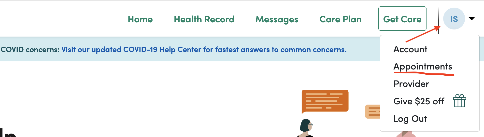
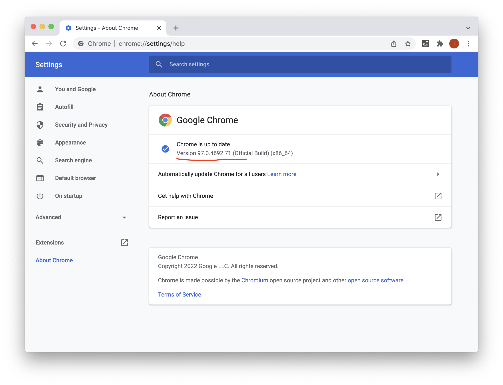
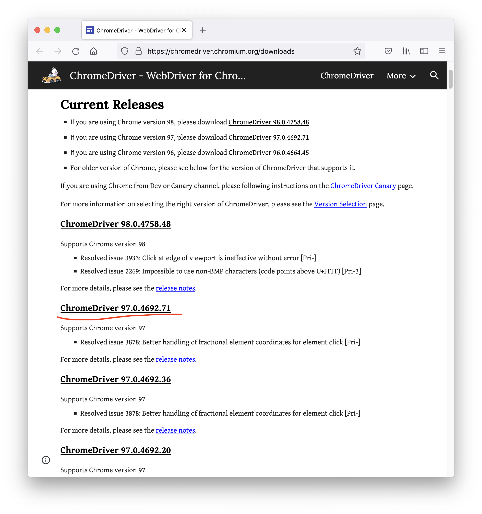
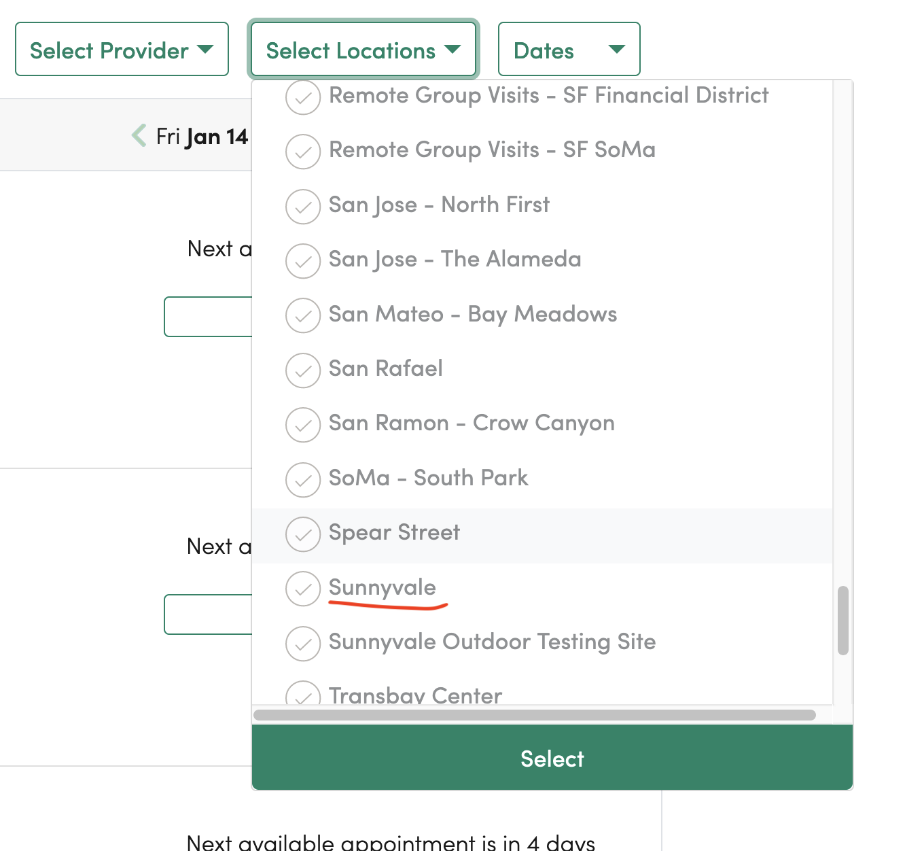

One Medical PCR sniper
======================

This application books a COVID PCR test appointment with One Medical once it becomes available.

If you can book an appointment directly from One Medical site or with another provider, you should do so. Otherwise, you can use this application so that it

1. Drives a web browser to log into One Medical account,
2. Searches for available appointments, and
3. Books one matching your criteria.

It keeps searching until an appointment matching your criteria becomes available.

This program does exactly what One Medical suggests you should do. It "checks back regularly" to see if appointments became available. Here is that the One Medical site says, literally:


To book an appointment, you will have to

1. Set up Haskell Stack and compile the application.
2. Download and run [WebDriver for Chrome](https://chromedriver.chromium.org/downloads) matching the version of Chrome installed at your system.
3. Configure your credentials and appointment search criteria.
4. Dry-run the program to confirm it correctly searches for appointments.
5. Run the program for an extended period until the desired appointment is available.

I suggest you start with loose criteria for step 3, get an appointment, and then refine your search criteria in step 3 and repeat from step 4. You should cancel an existing appointment as soon as possible once you get a better one (closer or earlier). Click on a menu in the top right corner of the site and select "Appointments." You will see your appointments there and can cancel the less-matching one.



You may want to write a function in Haskell to customize your appointment selection criteria.

Setup Haskell Stack and compile the application
-----------------------------------------------

On Linux/macOS, run

`curl -sSL https://get.haskellstack.org/ | sh`

On Windows, use [this installer](https://get.haskellstack.org/stable/windows-x86_64-installer.exe).

Read [Stack Intall/Upgrade](https://docs.haskellstack.org/en/stable/install_and_upgrade/) instructions for more details.

Once you get Stack installed, you should go to the directory you cloned this repo to and build the application:

```
$ stack build
```

The build will take about 20 minutes to complete.

You will see something like the following at the end:

```
Installing executable one_medical in /Users/ilya/safeplace/projects/projects_log/20220105_pcr_sniper/.stack-work/install/x86_64-osx/bb55b0183003d9fd6f944a319ba19b13f05e132815290cdc419812323b8f3d76/8.10.7/bin
Registering library for pcr-sniper-0.0.1.0..
```

Try running the application as follows. It should fail.

```
$ stack run
one_medical: HttpExceptionRequest Request {
  host                 = "localhost"
  port                 = 9515
  secure               = False
  requestHeaders       = [("Accept","application/json;charset=UTF-8"),("Content-Type","application/json;charset=UTF-8")]
  path                 = "/wd/hub/session"
  queryString          = ""
  method               = "POST"
  proxy                = Nothing
  rawBody              = False
  redirectCount        = 10
  responseTimeout      = ResponseTimeoutDefault
  requestVersion       = HTTP/1.1
}
 (ConnectionFailure Network.Socket.connect: <socket: 49>: does not exist (Connection refused))
```

This failure is expected because we didn't install and run WebDriver for Chrome yet.

Download and run WebDriver for Chrome
-------------------------------------

Open Chrome and type `chrome://settings/help` in the address bar. You will see something like the following:



The page will have a Chrome version number. I highlighted it in red. Go to the WebDriver for Chrome [Downloads](https://chromedriver.chromium.org/downloads) and get the ChromeDriver of the same version as your Chrome. I would get the highlighted version to match my version of Chrome. Your version may be different:



You will need to pick an archive for Linux, Mac, Mac M1, or Windows.

Run the Chrome Driver with the following arguments once downloaded and extracted:

```
$ ./chromedriver --port=9515 --url-base=/wd/hub
Starting ChromeDriver 97.0.4692.71 (adefa7837d02a07a604c1e6eff0b3a09422ab88d-refs/branch-heads/4692@{#1247}) on port 9515
Only local connections are allowed.
Please see https://chromedriver.chromium.org/security-considerations for suggestions on keeping ChromeDriver safe.
ChromeDriver was started successfully.
```

Configure your credentials and appointment search criteria
----------------------------------------------------------

Open `app/one_medical.hs` in an editor.

You will see the following declaration for application parameters:

```haskell
params
  = FindAppointmentParams
  { user = "<your email registered with OneMedical>"
  , password = "<your OneMedical password>"
  , area = "SF Bay Area"
  , appointmentType = "COVID-19 PCR Test"
  , lastDay = fromGregorian 2022 01 20
  , predicate = locationsInP southBayLocations
  }
```

Provide your One Medical email and password as values of `user` and `password` fields of the `FindAppointmentParams` record. For example:

```haskell
params
  = FindAppointmentParams
  { user = "someone@yahoo.com"
  , password = "MySecretPass1"
  [...]
  }
```

Specify `lastDay`. The program will search appointments from today until the value of the `lastDay`. `lastDay = fromGregorian 2022 01 20` means that it will search from today until January 20th, 2022.

Configure appointment search criteria. An obvious use case is to provide locations of interest. The simplest way is to feed a list of locations into the `locationsInP` function. For example, the following will only look for appointments in three offices.

```haskell
predicate = locationsInP ["Redwood City", "Palo Alto", "Sunnyvale"]
```

Location strings should match exactly "Select Locations" in One Medical UI. For example, "Sunnyvale" is one of the valid strings:



An example list of "south bay" locations is available in `app/one_medical.hs`, `predicate = locationsInP southBayLocations` where:

```haskell
southBayLocations =
  [ "Sunnyvale"
  , "Sunnyvale Outdoor Testing Site"
  , "San Mateo - Bay Meadows"
  , "San Jose - The Alameda"
  , "San Jose - North First"
  , "Redwood City"
  , "Phillips Brooks School COVID Testing Site" -- Menlo Park
  , "Palo Alto"
  ]
```

You may define your own list.

You may search for appointments "not in locations", for example:

```haskell
params
  = FindAppointmentParams
  { ...
  , predicate = not . locationsInP [ "UCSF One Medical Testing Site"
                                   , "Sunnyvale Outdoor Testing Site"
                                   ]
  }
```

Predicate function takes an `Appointment` and must return `True` if the appointment matches your criteria. You may write a custom `predicate` function in Haskell. The following example accepts an appointment if the provider's location doesn't have "San Jose" infix and the time of an appointment is after 10 am:

```haskell
params
  = FindAppointmentParams
  { ...
  , predicate = \appt ->
      not ("San Jose" `T.isInfixOf` location (providerInfo appt))
      && (localTimeOfDay (time appt) >= TimeOfDay 10 0 0)
  }
```

You can change `area` to wherever region where One Medical is available, i.e., "New York," "Chicago," etc.

Dry-run the program to confirm it correctly searches for appointments
---------------------------------------------------------------------

If an appointment you need is available, just book it. You don't need this program. Otherwise, you should run this program in the "dry-run mode" first to see if it can NOT find an appointment you need and loops. This step will guarantee that you don't book an appointment you don't need.

Now that you have your Chrome Web Driver running, credentials, and search criteria configured, you can check that the program keeps scanning for appointments:

1. Make sure you have the following definition of `main` in `app/one_medical.hs`

    ```haskell
    main = runSession remoteConfig findAppointments
    ```
    
    We don't want it to be `bookAppointment` yet.
    
2. Execute `stack run`
3. You should observe something like this:

    
    
The program goes into One Medical account and loops over the appointment schedule because it can't find a matching appointment. It prints appointments it considered to the console. You can examine that these appointments are indeed NOT what you need. Example output:
    
```
No appointments found between 2022-01-14 and 2022-01-16
No appointments match predicate:
[ Appointment
    { providerInfo = ProviderInfo
        { location = "San Mateo - Bay Meadows" }
    , time = 2022 - 01 - 19 10 : 50 : 00
    , element = Element "0.37229807800837955-298"
    }
, Appointment
    { providerInfo = ProviderInfo
        { location = "Burlingame" }
    , time = 2022 - 01 - 19 14 : 30 : 00
    , element = Element "0.37229807800837955-299"
    }
...
]
pageLastDay >= lastDay: 2022-01-19 >= 2022-01-17
```

Appointments in this sample got rejected because `lastDay = fromGregorian 2022 01 17`. The requested last day is January 17th, but the nearest appointments are on January 19th.

If the program stops at this stage, then you've found an appointment that matches your criteria. Just book it manually.

Run the program until the desired appointment is available
--------------------------------------------------------

Now that you know that the program doesn't find a matching appointment, you should leave it running in a "booking" mode so that it books an appointment matching your criteria as soon as it becomes available.

Change the `app/one_medical.hs` such that

```haskell
main = runSession remoteConfig bookAppointment
```

Execute `stack run` and wait until the program stops after a successful booking. The program is not 100% reliable. It may fail for a few reasons. So, you may want to check on it once in a while to see if it still runs.

